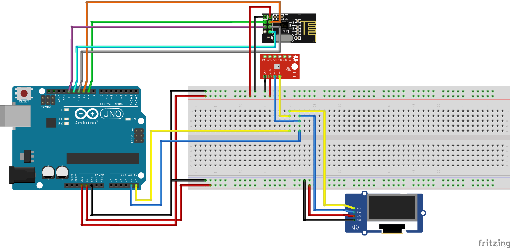

# Weather Arduino Sensor

The purpose of this project is to build a weather station with Arduino capable of collecting data on temperature, humidity, atmospheric pressure, and altitude. After collecting these data, they are displayed on an OLED display and sent to a base station to store the data.

## Sensors
To build this project was used on an Arduino Nano (the Arduino Uno can be used too) with the following sensors:

* **BME280** - Sensor capable to collect data about temperature, humidity and pression. The altitude is calculated based on pression reading.
* **OLED Graphic Display 128x64 with SSD1306 controller** - Graphical display to show the collected data by BME280 sensor;
* **NRF24l01** - Wireless transceiver module used to transmit the collected data by sensor to base station.

## Libraries
Were used the following libraries to write the weather station software:

* **Adafruit BME280 Library**: This library is necessary to access the *BME280* sensor by arduino;
* **Adafruit Unified Sensor**: Necessary dependency to use correctly the *Adafruit BME280 Library*
* **RF24 by TMRh20**: Necessary library to use the *NRF24l01* sensor;
* **RF24Network by TMRh20**: Necessary library to create a sensor network using the *NRF24l01* transceiver;
* **U8glib**: Necessary library to write text on the *OLED Graphic Display 128x64*

The libraries listed above must be installed through the **Library Manager** of **Arduino IDE**.

## Electrical Schematic
The figure bellow show as the phisical sensors must be connected on Arduino:

## Related Projects

This project only reads the temperature, humidity, pressure, and altitude and sends this data to a base station. A dashboard was also built in HTML5, CSS3, and JS that displays this data to the user by consuming a REST API exposed by the base station. For more details of the base station project or dashboard project, visit:

* [Raspberry Pi Weather Base Station](http://google.com)
* [Weather Station Dashboard](http://google.com)